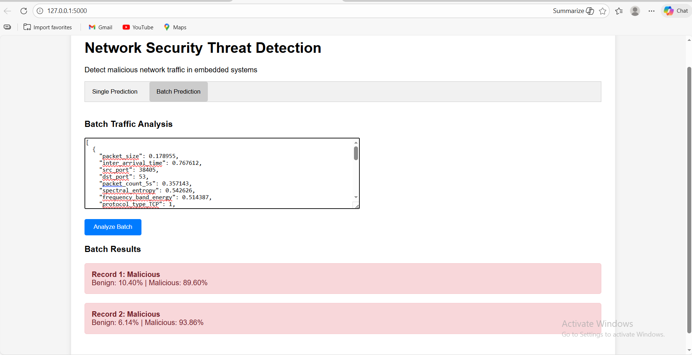

# [Network Anomaly Detection with ML](https://github.com/sabasabafaraz789/Network-Traffic-Anomaly-Detection-Ml-Model/blob/fbe1731ce69f29799740d0b461815319676dbbc6/Network%20Traffic%20Anomaly%20Detection%20ML%20Pipeline.py)

This machine learning project focuses on detecting  anomalies in embedded system network traffic using  **feature engineering** and **supervised machine learning** techniques. The system analyzes network packet data to identify malicious activities by examining port patterns and other network characteristics.

## Dataset Sources

Network traffic data 1000 samples from  [Network Traffic Anomaly Detection Dataset]([ https://www.kaggle.com/datasets/wcukierski/enron-email-dataset](https://www.kaggle.com/datasets/ziya07/network-traffic-anomaly-detection-dataset))

## Key Technical Components

**1. Data Preprocessing**

Boolean feature conversion to integers

Robust scaling for outlier-resistant normalization

Stratified train-test splitting (80-20 ratio)

**2. Feature Engineering**

Suspicious Port Detection: Flagging known suspicious ports

Port-based Features: Features focusing on security-relevant port patterns

**3. Machine Learning Models**

The project implements and compares multiple ensemble models:

Random Forest

XGBoost

Gradient Boosting

**4. Model Optimization**

GridSearchCV: Hyperparameter tuning with 5-fold cross-validation

ROC-AUC Scoring: Optimizing for binary classification performance


## Performance Results

**Best Model:** Random Forest

**Accuracy:**  1.0

**ROC-AUC:** 1.0

 ## Flask App
 To run Flask app:

 1. Install dependencies:
    
    ```bash
    pip install -r requirements.txt
    ```
    
 3. Train the model:
    
    ```bash
    python train_model.py
    ```
    
 5. Run the Flask app:
    
    ```bash
    python app.py
    ```


    

## 👨‍💻 Author
Developed by **Saba Faraz**  
📧 Email: farazsaba96@gmail.com

---
